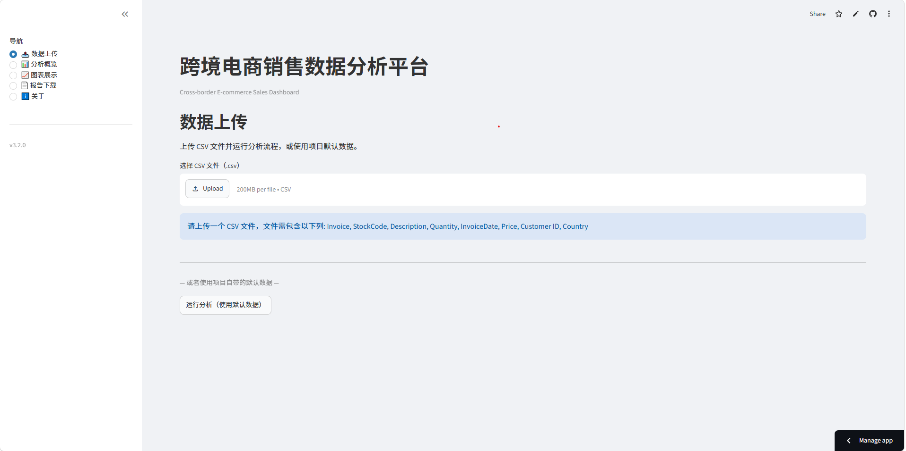
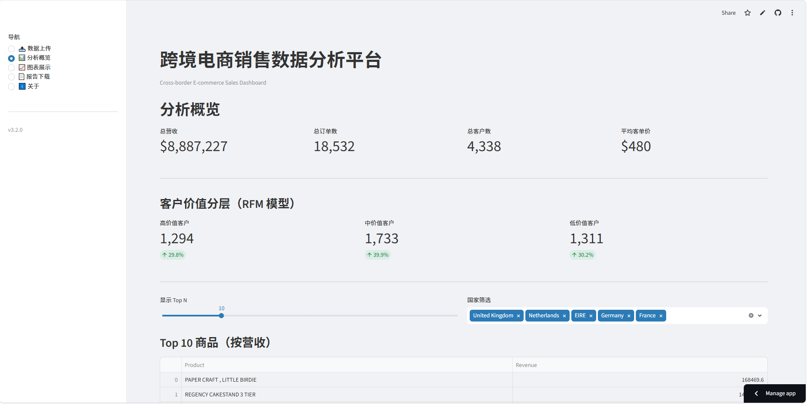
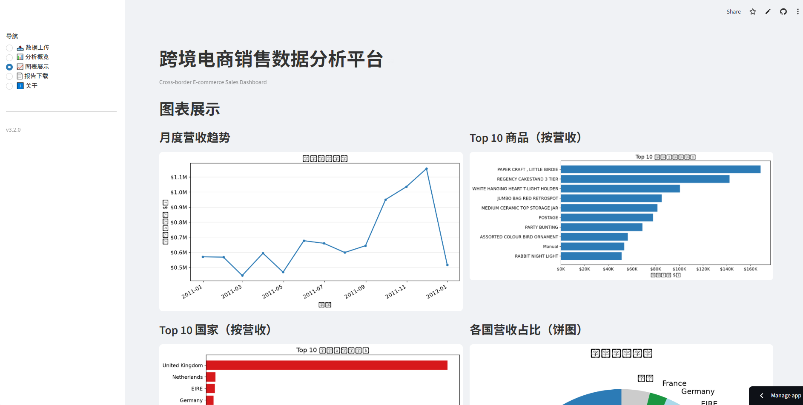

# Cross-border E-commerce Sales Dashboard

跨境电商销售数据分析平台 — 我的第一个数据分析作品集项目。

[](https://www.python.org/)
[](https://streamlit.io/)
[](tests/)
[](https://github.com/astral-sh/ruff)

## Overview

本项目对 54 万条跨境电商交易记录进行端到端分析，提供 **CLI** 和 **Web** 两种使用方式：

- **销售分析**：营收趋势、季节性波动、国家市场表现
- **商品分析**：热销商品排行、退货率、商品品类洞察
- **客户分析**：客户地理分布、RFM 分层、客户生命周期价值

> V1.0 已冻结。V3.2 为当前版本，完成 Streamlit 展示层 + 交互式分析 + 发布就绪。

## Features

| 功能 | CLI (`main.py`) | Web (`app.py`) |
|------|:---:|:---:|
| 一键运行 6 阶段 Pipeline | ✅ | ✅ |
| CSV 文件上传 | — | ✅ + 列校验 |
| KPI 指标卡片 | 终端表格式 | `st.metric()` 卡片 |
| 客户 RFM 分层 | ✅ | ✅ + 百分比 delta |
| Top 商品 / 国家排行 | Top 5 | Top N（滑块可调） |
| 国家筛选 | — | 多选过滤器 |
| 8 张 Matplotlib 图表 | 保存为 PNG | 在线展示（2 列网格） |
| HTML 报告 | 浏览器打开 | 在线预览 + 一键下载 |
| 执行耗时 | — | ✅ |

## Demo

> Screenshots coming soon — see [assets/](assets/) for instructions.

```
streamlit run app.py
```

| 数据上传 | 分析概览 | 图表展示 |
|:---:|:---:|:---:|
|  |  |  |

## Architecture

```
Presentation Layer    main.py (CLI) + app.py (Web)  ← 双入口
    │
Application Layer    src/pipeline/              ← 流程编排（6 阶段）
    │
Business Layer       sales_analyzer, customer_analyzer,
                     visualizer, report_generator  ← 纯计算
    │
Data Layer           data_loader, data_cleaner  ← I/O
    │
Infrastructure       src/config/, src/logger/, src/exceptions/,
                     src/models/, src/ui/        ← 横切能力
```

## Results

| 指标 | 数值 |
|------|------|
| 清洗后交易记录 | 392,693 行（去重去脏 27.5%） |
| 总营收 | $8,887,227 |
| 总订单 | 18,532 |
| 总客户 | 4,338 |
| 平均客单价 | $480 |
| 高价值客户占比 | 29.8% |

## Tech Stack

| Layer | Technology |
|-------|-----------|
| Language | Python 3.12+ |
| Data | Pandas, NumPy |
| Visualization | Matplotlib |
| Web UI | Streamlit |
| Reports | HTML + CSS（自包含，base64 内嵌图片） |
| Code Quality | Black, Ruff |
| Testing | pytest（15 tests, 3 modules） |
| Config | YAML + Python defaults（双层层叠） |
| Version Control | Git（Conventional Commits） |

## Project Structure

```
cross-border-dashboard/
├── app.py                # Streamlit Web 入口（薄壳路由）
├── main.py               # CLI 入口
├── src/
│   ├── ui/               # Streamlit 展示层组件（7 modules）
│   ├── config/           # 全局配置（YAML + Python defaults）
│   ├── logger/           # 统一日志系统（控制台 + 文件）
│   ├── exceptions/       # 自定义异常体系（6 类）
│   ├── models/           # 数据模型（PipelineResult 等）
│   ├── pipeline/         # 流程编排（6 阶段 Pipeline）
│   ├── data_loader.py    # Data Layer — CSV → DataFrame
│   ├── data_profiler.py  # Data Layer — 数据质量诊断
│   ├── data_cleaner.py   # Data Layer — 6 步清洗
│   ├── sales_analyzer.py # Business Layer — 销售 KPI
│   ├── customer_analyzer.py  # Business Layer — RFM 分层
│   ├── visualizer.py     # Business Layer — 8 张图表
│   └── report_generator.py   # Business Layer — HTML 报告
├── tests/                # pytest（15 tests, 3 modules）
├── assets/               # Demo 素材（截图 + 架构图）
├── docs/                 # 架构与规范文档
├── .streamlit/           # Streamlit Cloud 部署配置
├── pyproject.toml        # Black, Ruff, pytest
├── TECH_DEBT.md          # 技术债务 & 未来路线图
└── ROADMAP.md            # 版本路线图
```

## Quick Start

```bash
# 1. 创建虚拟环境
python -m venv .venv
source .venv/bin/activate       # Windows: .venv\Scripts\activate

# 2. 安装依赖
pip install -r requirements.txt

# 3. 放入数据 — 将 sales.csv 复制到 data/raw/sales.csv

# 4. 运行（二选一）
python main.py                  # CLI 模式
streamlit run app.py            # Web 模式

# 5. 测试
pytest tests/ -q

# 6. 检查代码质量
ruff check src/ tests/ main.py app.py
```

## Deployment (Streamlit Community Cloud)

1. Push this repo to GitHub
2. Go to [share.streamlit.io](https://share.streamlit.io)
3. Click "New app" → select repo → set Main file path to `app.py`
4. Deploy — no additional config needed

The app auto-detects `config/config.yaml` if present; otherwise falls back to Python defaults.

## Version Progress

| Version | 主题 | 状态 |
|---------|------|------|
| V1.0 | Local Analytics — 6-step Pipeline + HTML Report | ✅ 已冻结 |
| V2.1–2.3 | Core Engineering — Config, Logger, Exceptions, ADR | ✅ 已完成 |
| V3.0–3.2 | Streamlit Dashboard — Web UI, Filters, Release Ready | ✅ 当前 |
| V4.0 | Interactive Analytics — Plotly | 🚧 规划中 |
| V5.0 | AI Report — LLM | 🚧 规划中 |
| V6.0 | Database Integration | 🚧 规划中 |
| V7.0 | Deployment — Docker + Cloud | 🚧 规划中 |

## Development

```bash
# 代码格式化
black src/ tests/ main.py app.py

# 代码检查
ruff check src/ tests/ main.py app.py

# 自动修复
ruff check --fix src/ tests/ main.py app.py
```

**Adding a new Streamlit page**: create `src/ui/<page>.py` with a `show()` function, then register it in `app.py`.

**Adding a new analysis module**: see [DEVELOPMENT.md](docs/DEVELOPMENT.md) for the full template.

## Documentation

- [V1 系统架构](docs/ARCHITECTURE_V1.md)（已冻结）
- [V2+ 系统架构](docs/ARCHITECTURE_V2.md)（分层模型 + 设计原则）
- [开发规范](docs/DEVELOPMENT.md)
- [Config 设计方案](docs/CONFIG_DESIGN.md)
- [架构决策记录](docs/decisions/)（ADR-001 ~ 004）
- [更新日志](CHANGELOG.md)
- [技术债务 & 路线图](TECH_DEBT.md)
- [版本路线图](ROADMAP.md)

## License

MIT — see [LICENSE](LICENSE) for details.
